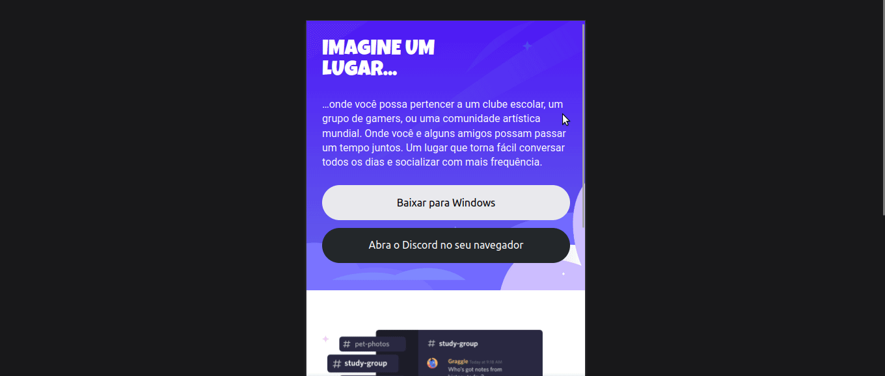
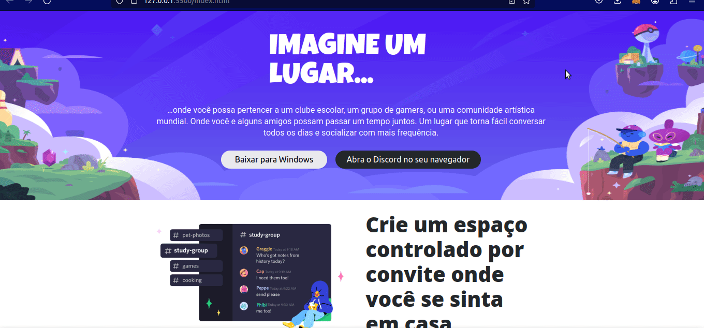

# Clone da Página do Discord com Design Responsivo em CSS

Este repositório faz parte do curso de CSS da [Digital Innovation One (DIO)](https://www.dio.me/). O objetivo é clonar a página do [Discord](https://www.discord.com/) de forma estática utilizando técnicas avançadas de CSS, com ênfase no design responsivo para garantir uma experiência consistente em dispositivos móveis e desktop.




## Sobre a Digital Innovation One (DIO)

A [Digital Innovation One](https://www.dio.me/) é uma plataforma educacional que oferece cursos online e gratuitos em diversas áreas da tecnologia. O curso de CSS proporciona conhecimentos essenciais para profissionais de front-end, incluindo técnicas avançadas de design responsivo.

## Importância do Conhecimento em Design Responsivo

O design responsivo é crucial para garantir que as interfaces web se ajustem adequadamente a diferentes tamanhos de tela, proporcionando uma experiência de usuário otimizada. Profissionais de front-end devem dominar técnicas de design responsivo para criar layouts flexíveis e amigáveis, atendendo às expectativas dos usuários em dispositivos variados.

### Conceito de Mobile-First no Design Responsivo

O conceito de **Mobile-First** no design responsivo preconiza que o desenvolvimento da interface comece com o foco em dispositivos móveis. Isso implica criar estilos e estruturas que sejam inicialmente pensados para telas pequenas e, posteriormente, aprimorar a experiência para dispositivos maiores. Essa abordagem melhora a velocidade de carregamento em dispositivos móveis e cria uma base sólida para adaptações em telas maiores.

## Como Replicar este Repositório Localmente

1. Clone o repositório para a sua máquina local:

    ```bash
    git clone https://github.com/igorlnunes/discord_responsivo
    ```

2. Acesse o diretório do projeto:

    ```bash
    cd discord_responsivo
    ```

3. Abra o arquivo `index.html` em seu navegador para visualizar o clone responsivo da página do Discord.

Agora você está pronto para explorar e estudar as técnicas de CSS aplicadas neste projeto!

🚀